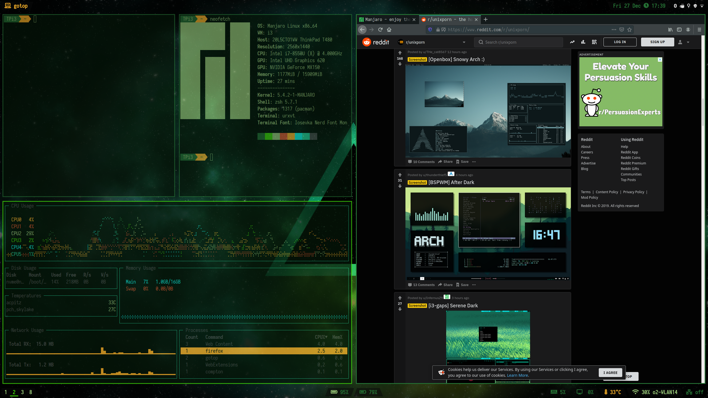

```
 _ _____  
(_)___ / 
| | |_ \ 
| |___) | 
|_|____/  

```
This is the documentation for the installation and use of the `Manjaro-i3` distro.
* [Manjaro](MANJARO.md)

## Status


## Basic settings
Installing new software under Manjaro is primarily be done through [pacman](PACMAN.md) the package manager. 
This is done through terminal by running `sudo pacman -s <package-name>` or through the GUI wrapper `pamac`, package description is `Add/Remove software`.

Mi3 has a terminal menu to manage settings, run it by pressing `$mod+Ctrl+b` or running `bmenu` in the terminal. This will open a text UI with options, to install new kernels, it's important to install more than one just in case it's needed for recovery. 
This can be important because Manjaro is a rolling distro based on Arch, and while is running behind the latest, to provide extra protection, it can on occasion break. To recover select a different kernel when booting. 

`bmenu` manages other system settings like manage drivers, if gaming is an option and graphic is NVIDIA, installations of bumblebee drivers is recomended. This can be installed by default in the initial OS installation. Check which graphics are correct for the setup, if NVIDIA optimus then use non-free graphics.

Mi3  has a very helpful user guide file included, accessible through `mod+Shift+h`, with some of the most important keyboard shortcuts.

Detailed settings:

* [Appearance](APPEARANCE.md)
* [Audio](WIP/AUDIO.md)
* [Battery](BATTERY.md)
* [Color Palette](COLOR-PALETTE.md)
* [Dotfiles](DOTFILES.md)
* [Firmware](FIRMWARE.md)
* [Package Manager](PACMAN.md)

## File Manager
Mi3 file managers are ranger, a terminal file manager, and `pcmanfm`, a more typical graphical interface.

Ranger is written in python, by default presents three columns, the middle one is the *working* panel, to move between them you can use arrows or other defined keys. The most right column allows previews for files and images. It includes capabilities *vim-like* with keybindings and bookmarks. It is also possible to use external scripts. 

To make `ranger` display hidden files edit `rc.conf` with `set show_hidden true`.

Ranger uses the default color scheme defined at `.Xresources`, but a specific theme can be set, adding `set colorscheme <scheme>`, original setup contains `deafult`, `jungle`, `snow` and `solarized` themes.
 
Adding to Ranger there is also pcmanfm, a standard linux integrated File Manager. Very similar to the gnome version.

## Menu
By default there dmenu, a fast and light menu for the X system, it's presented as a bar, usually on the top, where it reads text from STDIN and creates a menu with options related to the user input, the navigation is done by moving through options using the arrow keys (or other defined for the same purpose) and uses the `dmenu_run` wrapper for application launcher.

To run it from the console run`dmenu_run`, if a top bar exists, like `i3status` or `polybar`, `dmenu` will appear on top of it.

However there are other options with more "eye-candy", one of those is rofi.

Install rofi, a "better dmenu" through pamac or `sudo pacman -S rofi`.

After installing edit the `.i3/config` file, comment the line about dmenu and add:
`bindsym $mod+d exec rofi -lines 12 -padding 18 -width 60 -location 0 -show drun -sidebar-mode -columns 3`
* This command works for the initial setup, some changes need to be made according to settings, for example using a rasi theme.

This will replace the usual call to `dmenu`. However `dmenu` still works if another keybinding is provided. That is a important setting case something breaks on installation.
To move between types like windows, ssh or drun press `shift+<arrows>` while on rofi.

Also it is possible to configure a faster keybinding like the one used on WindowsOS. For moving between open windows: 
`bindsym $mod+Tab exec rofi -lines 12 -padding 18 -width 60 -location 0 -show window -sidebar-mode -columns 3`

Rofi can be configured in several different ways.
`rofi -help` will give you the current configuration and location.
By adding `~/.config/rofi/config.` you can specify the look and feel of rofi window.

Another option, more powerful but easier to update is using rasi configurations, this allows to define a theme, with a color pattern and different settings, as an example is possible to define looks for specified modules.
Rasi themes work in addition to the config file.
This allows visuals more complex, but defined with a more modular approach, easier to manage and change, also make it easy to integrate with scripts. 
To find themes got to [rasi-themes](https://github.com/davatorium/rofi-themes), this repo has a few to use or as example.

Mi3 also has a small categorized menu cascade style `morc_menu`, called with `mod+z`, that will open a simple menu up top, displaying categories with applications. Good emergency option.

## Text Editor
There are as usual several options already installed. `vim` and `nano` are already in Mi3.

For a windowed text editor Mi3 brings `mousepad`, however gnome-editor `gedit` is a reliable option. 
Out of the box spellcheck is not working on gedit. Some missing languages or conflict  with the languages installed.
Gedit uses `enchant` which act as a fronted for several spell checkers, some of those being `Hunspell`, `MySpell`, `Ispell` and `Aspell`.
In `pamac` it's possible to install more packages, for example, `aspell-en` and `aspell-de`, this will add English and German spell checkers.

To edit colors install `gedit color scheme` plugin from pamac, this usually installs the `developer-plugins`, which are a group of add-ons for gedit.
To configure the new color scheme, enter `gedit` select `color scheme editor` and configure the changes needed, save under a new name and ID, this will save the new configuration to `.local/shares/gedit/styles`.
Sometimes it add an underline under some text, just enter color scheme again and remove it.

Other option is to use something like OSS-Code (Visual Studio Code), Sublime, Atom, etc...

## Monitoring
For monitoring some favorite options are neofetch, to get system info, and `gotop`, to get live system status.
`gotop` is a terminal "eye-candy" version of common tools like `htop`.

[Neofetch](https://github.com/dylanaraps/neofetch) configuration file is placed in `.config/neofetch`, in it it's possible to change position of display information, also witch info is displayed. It is also possible to change the image displayed.

Mi3 comes with `htop` and `screenfetch`, `htop` is visually less clear and `screenfetch` is not as configurable.

Most of options available on `htop`, `ytop` or `gotop` are possible to get if configured on `i3bar/i3status` or `polybar`.

## Network Manager
The network manager already is installed, to configure the VPN download the OpenVpn server configuration file and add a new VPN using the Network Manager configuration.

By default UDP is the recommended connection, less stable but more adequate to over the web communications.
Firefox however does not block webRTC javascript requests, that makes it insecure to use video streams and other uses as well.
It is possible to change this over Firefox configuration, however some use can be affected. 

Chromium does block this by default, and also has a specific add-on for this.

## Programming
Intellij is available through pamac. It is also possible to install more recent implementations of java, openjdk11 is the one more widely used. Is also available through the same way.

* [Java](PROGRAMMING.MD#java)

## Print Screen
To take a print screen there is i3scrot, a command line application that takes a screenshot of your open displays.
It's possible to use the Mi3 binds to take a screenshot without the command line, to do that press `Print` or `mod+Print` to take full screen, or `mod+Shift+print` to select the area. Both are stored at `~/Pictures` by default.

# Dependencies
Managed dependencies on this documentation.

| Package        | Description                                                                             |
| :------------: |:--------------------------------------------------------------------------------------- |
| [AUR](PACMAN.md#AUR) | Community driven repository
| [caffeine](APPEARANCE.md#caffeine) | Prevents screen-saver and "sleep" 
| [cava](WIP/AUDIO.md#cava) | Sound vizualizer 
| [compton](APPEARANCE.md#compton) | Compositor, used to manage for example transparency and shadow
| [conky](OTHERS.md#conky) | Lightweight system monitor, used on desktop 
| [dunst](APPEARANCE.md#dunst) | Notification manager
| [dmenu](I3.md#Menu) | Desktop Menu, also used as package launcher
| [feh](APPEARANCE.md#wallpaper) | Image viewer, can be used to manage desktop background
| [fwupd](FIRMWARE.md) | Firmware Manager
| [gedit](I3.md#text-editor) | Gnome UI Text editor
| [git-secret](GIT-SECRET.md) | Git tool to encrypt files
| [gcolor2](COLOR-PALETTE.md#gcolor2) | Color picker GUI
| [geoclue2](APPEARANCE.md#redshift) | Location framework
| [gtk](GNOME.md) | GTK detail configuration
| [i3bar](APPEARANCE.md#menu-bar) | Status bar
| [i3scrot](I3.md#print-screen) | Screen capture utility
| [lightdm](APPEARANCE.md#login-manager) | Display Manager, used to manage login
| [logiops](MOUSE.md) | Bluetooth mouse configuration 
| [lxappearance](APPEARANCE.md#icon-packs-cursors-and-fonts) | Gtk theme switcher
| [neofetch](I3.md#monitoring) | Command line system information tool
| [nitrogen](APPEARANCE.md#wallpaper) | Background manager
| [pacman](PACMAN.md#pacman) | Package Manager
| [pale moon](OTHERS.md#palemoon) | Browser
| [pamac](PACMAN.md#pamac) | Package Manager GUI wrapper
| [polybar](POLYBAR.md) | Status bar, powerful and configurable
| [pywal](APPEARANCE.md#pywal) | Color scheme generator
| [ranger](I3.md#file-manager) | File Manager
| [redshift](APPEARANCE.md#redshift) | Screen color temperature utility
| [rofi](I3.md#Menu) | Window switcher, also used as package launcher
| [screenfetch](OTHERS.md#screenfetch) | Bash system information tool
| [spotify](WIP/AUDIO.md#spotify) | Spotify official player
| [spicetify-cli](WIP/AUDIO.md#spicetify) | Spotify wrapper
| [stow](DOTFILES.md#stow) | Symlink utility, used for generating git managed configuration files
| [tizonia]((WIP/AUDIO.md#tizonia)) | Terminal audio stream player 
| [tlp](BATTERY.md#tlp) | Battery Manager
| [viewnior](APPEARANCE.md#wallpaper) | Image viewer
| [yay](PACMAN.md#AUR) | Command line AUR helper

## Addicional packages
[Others](OTHERS.md)
[Maintenance](MAINTENANCE.md)

## TODO

[Todo](WIP/TODO.md)
